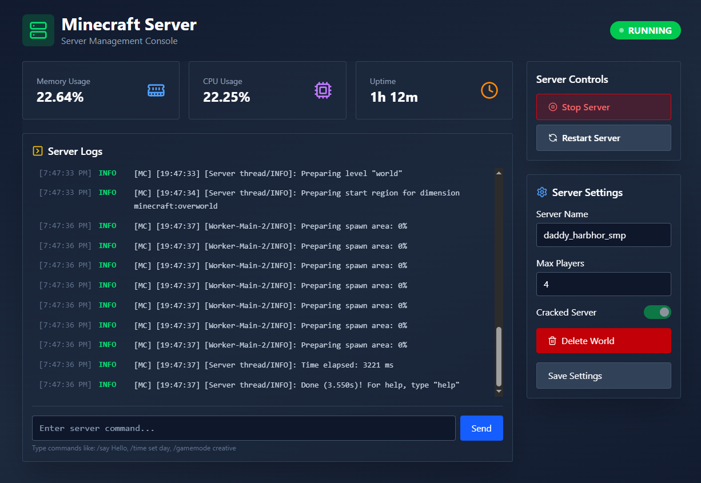

# ⛏️ Minecraft Hosting Panel (PixelHost)

A self-hosted web interface to host, manage, and control Minecraft servers — built for performance, simplicity, and full control.

## 🌐 About the Project

This project provides a modern, self-hosted Minecraft server hosting panel designed to run on Ubuntu.

> Created to play Minecraft with my friends

## 🚀 Features

- 🖥️ Web-based control panel (React/Express)
- ⚙️ Shell integration using `child_process` in Node.js
- 📡 Real-time logs via Server-Sent Events (SSE)

## 🛠 Tech Stack

- **Frontend**: React + TailwindCSS
- **Backend**: Node.js + Express

## 🖥️ Hosting Environment

- OS: Ubuntu Server (self-hosted)
- Node.js: v18+
- Ports: `80/443` for panel, `25565+` for Minecraft servers
